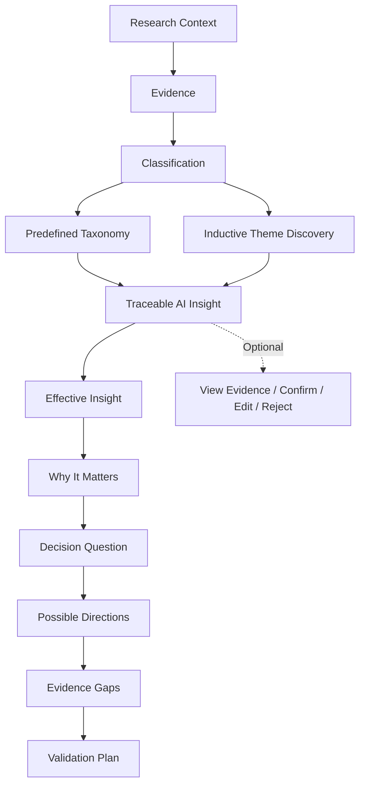

# Evidence to Decision

> Turn unstructured evidence into traceable insights and decision support — without losing the reasoning in between.

Evidence to Decision turns qualitative evidence into themes, traceable insights,
decision questions, evidence gaps, and validation plans. Important outputs retain
provenance back to the original Evidence IDs, so readers can inspect what supports
each conclusion and what remains unknown.

## Why this exists

A common analysis path is `feedback → clustering → summary → recommendation`.
Along the way, conclusions can become detached from source evidence, predefined
taxonomies can miss unexpected themes, and recommendations can hide uncertainty.

This project instead emphasizes:

`Evidence → Insight → Decision Question → Evidence Gap → Validation`

It supports research and decision framing; it does not make or execute business
decisions.

## How it works



Optional Verification is not a default approval gate. AI-generated insights can
continue as clearly marked `unreviewed` output; a user can inspect evidence and
confirm, edit, or reject an insight when useful.

## What makes it different

### Generic Evidence abstraction

The core input is Evidence, not a platform-specific comment. An `EvidenceRecord`
can represent a customer inquiry, product review, CRM or sales note, survey
free-text response, interview note, social feedback, or YouTube comment. This is
a data-model capability; v0.1 does not include live connectors for every source.

### Taxonomy plus inductive discovery

Profiles provide stable taxonomies for known questions. Inductive Theme Discovery
can identify patterns that are `covered`, `partially_covered`, or `emergent`
relative to the selected taxonomy. Coverage remains an explainable research
judgment rather than a claim of objective completeness.

### Evidence-level traceability

The provenance chain is preserved:

`Decision Brief → Effective Insight → Theme → Evidence IDs → Original Evidence`

Providers cannot add out-of-scope Evidence IDs to downstream results.

### AI-first, human-on-demand

Verification status records workflow state, not truth level:

- `unreviewed`: original AI output; downstream eligible by default.
- `reviewed`: explicitly confirmed without changing the source draft.
- `edited`: explicitly revised; the revised form is used downstream.
- `rejected`: excluded from downstream use.

`review_recommended` is advisory and includes reasons. It does not block the
default workflow.

### Decision support, not automated decisions

Decision Briefs separate Why It Matters, a neutral Decision Question, Possible
Directions, Evidence Gaps, a Validation Plan, and uncertainty. Possible Directions
are options to consider—not proven recommendations.

### Explicit gaps and validation planning

The system records both what the evidence suggests and what it cannot establish.
Validation Plans describe possible next checks; the software does not execute them.

## Current v0.1 capabilities

- Generic JSON Evidence input
- YouTube source workflow through the official API
- `ResearchContext` with `exploratory` and `decision_focused` modes
- `general_feedback`, `consumer_product`, `game_publishing`, `gtm_research`, and
  `overseas_content` profiles
- Rule candidates and profile-aware semantic classification
- Taxonomy-based Theme Discovery
- File-based / agent-assisted inductive Theme Discovery
- Traceable Insight Drafts and Effective Insights
- Optional Verification with confirm, edit, and reject
- Decision Briefs, Evidence Gaps, and Validation Plans
- Evidence-first Generic Workbook and source-specific YouTube Workbook
- Provider extension interfaces and an offline deterministic test suite

## Supported inputs

Currently supported ingestion:

- Generic Evidence JSON
- Public YouTube comments through the official YouTube Data API v3

The Evidence abstraction can represent other qualitative sources, but v0.1 does
not ship live Reddit, Steam, TikTok, CRM, helpdesk, email, or collaboration-tool
connectors.

## AI / LLM execution

Taxonomy-based workflows run deterministically. LLM-assisted steps use provider
interfaces. The built-in provider is file-based: it writes structured request
files, a compatible coding or AI agent such as Codex supplies schema-constrained
responses, and Python validates schema, Evidence IDs, provenance, and merges.

Tests use deterministic fake providers. v0.1 does not ship built-in OpenAI,
Anthropic, or Gemini API adapters and does not automatically call a model API.

## Installation

Python 3.11 or newer is required.

```bash
python -m venv .venv
```

Activate the environment, then install the package and test dependencies:

```bash
python -m pip install -e ".[test]"
```

The installed command is `youtube-comment-research`. The script entry point
`python scripts/youtube_comments.py` remains available.

## Quick Start: offline Generic demo

This release includes fictional, prevalidated semantic artifacts. Generate the
Evidence-first workbook without an API key, external model, or network semantic
call:

```bash
youtube-comment-research report examples/classification_example.csv \
  --output output/example_evidence_to_decision.xlsx \
  --profile general_feedback \
  --theme-insights examples/theme_insight_example.json \
  --decision-briefs examples/decision_brief_example.json
```

Open `output/example_evidence_to_decision.xlsx` to inspect classification,
themes, insights, evidence scope, source comparison, optional verification state,
and Decision Briefs.

## Ways to run

### Agent-assisted mode

Clone the repository, open it with a compatible coding or AI agent, and ask the
agent to follow `SKILL.md`. The agent can run deterministic steps, complete the
built-in file-based semantic request/response exchange, and let Python validate
the resulting artifacts. Agent-skill support varies by client.

### CLI / standalone workflow

Prepare profile-aware classification batches:

```bash
youtube-comment-research prepare-classification examples/generic_evidence.json \
  --output-dir output/classification \
  --profile general_feedback
```

Complete each requested `classified_batch_NNN.jsonl`, then validate and merge:

```bash
youtube-comment-research merge-classification examples/generic_evidence.json \
  output/classification \
  --output output/classification_result.csv \
  --profile general_feedback
```

Taxonomy Theme Discovery is deterministic:

```bash
youtube-comment-research generate-insights output/classification_result.csv \
  --output output/theme_insights.json \
  --profile general_feedback \
  --theme-method taxonomy
```

Use `--theme-method llm --llm-work-dir output/theme_work` for the built-in
file-based, agent-assisted inductive workflow. The command writes requests and
waits for separately completed response files; it does not call a model API.

Resolve downstream Effective Insights:

```bash
youtube-comment-research resolve-insights output/theme_insights.json \
  --output output/effective_insights.jsonl
```

`generate-decision-brief` uses the same file-based request/response pattern.
Run `youtube-comment-research generate-decision-brief --help` for its validated
input, work-directory, and output options.

## Generic Evidence input example

```json
[
  {
    "evidence_id": "e1",
    "text": "The minimum order quantity is too high for a first order.",
    "source_type": "customer_inquiry",
    "market": "EU"
  }
]
```

Required fields are `evidence_id`, `text`, and `source_type`. Optional fields are
`source_name`, `created_at` (or input alias `timestamp`), `language`, `market`,
`region`, and `metadata`.

## Output example

```text
Theme: Approval, price, and migration effort block adoption
Insight: The supplied evidence identifies distinct security, affordability,
         and migration constraints; it does not show which is most prevalent.
Why It Matters: Treating different constraints as one objection can produce an
                ill-targeted response.
Decision Question: Which constraint is material in the target segment and
                   feasible to address or clarify?
Possible Direction: Validate constraints separately before prioritizing a response.
Evidence Gap: No segment-level frequency or outcome data ranks the constraints.
Validation Plan: Segment interviews plus available stalled-evaluation reasons.
Supporting Evidence IDs: gf-003, gf-004, gf-013
```

## Optional Verification

Prepare optional review material only when a user wants to inspect or revise an
Insight:

```bash
youtube-comment-research prepare-review output/theme_insights.json \
  --output output/review_packet.json
```

Apply explicit confirm/edit/reject decisions with `apply-review`, then pass the
result to `resolve-insights --human-review`. Without a decision, the original
Insight remains `unreviewed` and downstream eligible. Rejected Insights are
excluded. `--require-review` is an explicit strict mode, not the default.

## YouTube source workflow

Set `YOUTUBE_API_KEY` only for live YouTube collection:

```bash
youtube-comment-research collect \
  --url "https://www.youtube.com/watch?v=VIDEO_ID" \
  --max-comments 100 \
  --order relevance \
  --include-replies \
  --anonymize-authors \
  --formats csv,xlsx,jsonl \
  --profile consumer_product \
  --output-dir output
```

Collection uses the official YouTube Data API v3 and reports quota, permission,
invalid-video, comments-disabled, and network errors. Public comments are not a
representative consumer survey.

## Architecture

See [`docs/ARCHITECTURE.md`](docs/ARCHITECTURE.md) for the Evidence abstraction,
provider boundaries, profiles, provenance, Optional Verification, Effective
Insights, and Decision Support design.

## Testing

```bash
python -m pytest
```

The current release candidate passes 253 offline tests. External semantic calls
are mocked. Regression coverage includes schema validation, Evidence-ID boundary
checks, provenance, Optional Verification, workbook compatibility, YouTube
presentation compatibility, and Decision Brief evidence scope.

## Limitations

- v0.1 has no dashboard or frontend.
- Built-in LLM-assisted workflows are file-based / agent-assisted.
- No built-in OpenAI, Anthropic, or Gemini API adapters are included.
- Live ingestion is limited to Generic JSON and the YouTube source workflow.
- Validation Plans are not automatically executed.
- The software does not make an automatic final business decision.
- Semantic quality depends on the agent, model, or custom provider used.
- General semantic accuracy has not been comprehensively benchmarked.
- This is decision support, not a substitute for domain expertise or high-stakes
  professional judgment.

## Roadmap

- Optional API-backed LLM providers
- More Evidence source adapters
- A richer Research Profile ecosystem
- Semantic evaluation and benchmarking
- An optional user interface

## License

MIT. See [`LICENSE`](LICENSE).
